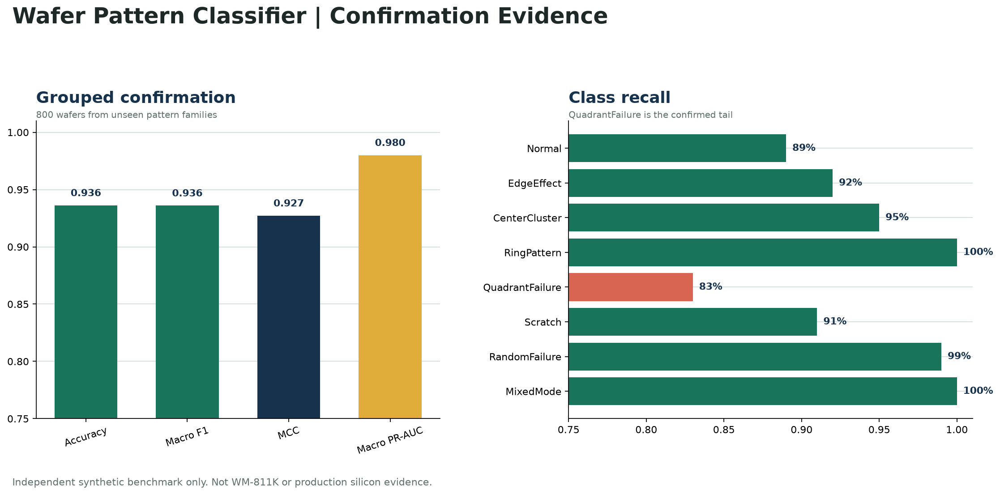
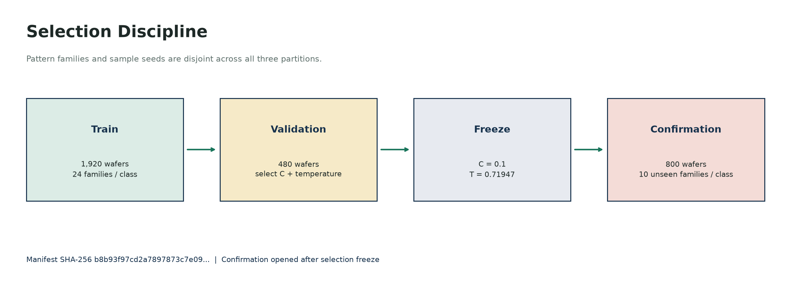
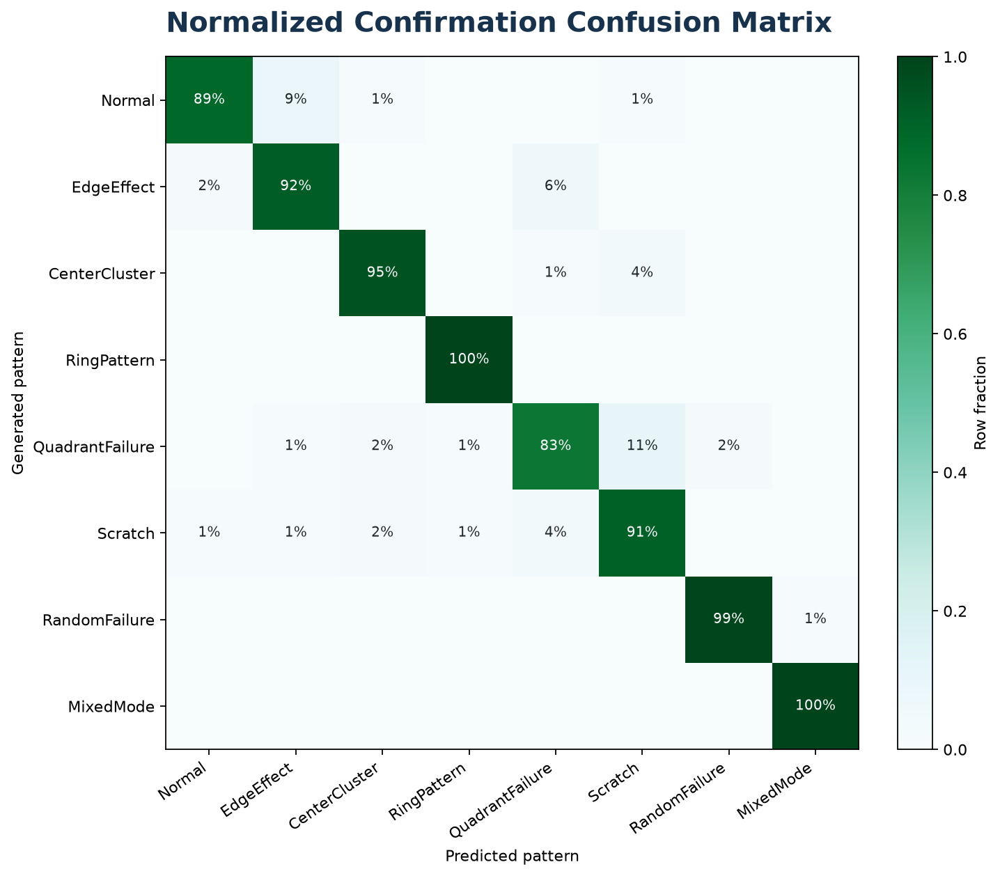
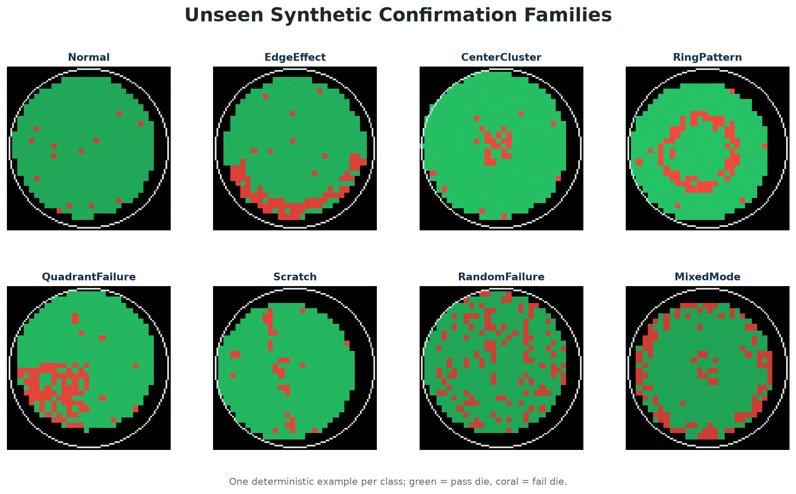

# ResNet Wafer Pattern Classifier

[](https://github.com/rajendarmuddasani/Transfer_Learning_ResNet_STDF_Wafer_Map_Yield_Predictor/actions/workflows/ci.yml)


A safety-scoped eight-class wafer-pattern classifier built around an ImageNet
ResNet-18 feature extractor, a validation-selected linear head, validation-only
temperature calibration, and an exact ONNX runtime artifact. The confirmed API
accepts bounded PNG/JPEG wafer-map images and returns calibrated class
probabilities with model and request identity.

The public benchmark is independently generated synthetic simulation. It is not
WM-811K evidence, production silicon validation, STDF parsing evidence, or a
yield-prediction outcome.

## Evidence Dashboard

| Grouped synthetic confirmation | Reproduced result |
|---|---:|
| Samples / unseen families | 800 / 80 |
| Accuracy | 93.63% (95% CI 91.71-95.12%) |
| Macro / weighted F1 | 0.9361 / 0.9361 |
| Balanced accuracy / MCC | 0.9363 / 0.9273 |
| Macro ROC-AUC / PR-AUC | 0.9966 / 0.9801 |
| Top-label ECE / multiclass Brier | 0.0270 / 0.0894 |
| Minimum class recall | 83.0% (QuadrantFailure) |
| Local ONNX CPU latency | 3.76 ms p50 / 10.72 ms p95 |
| PyTorch/ONNX parity | Passed |

Canonical evidence:

- [Confirmation evaluation](evidence/public_synthetic_evaluation.json)
- [Dataset and split manifest](evidence/public_synthetic_dataset_manifest.json)
- [Claim ledger](evidence/claims.json)
- [PDF/repository audit](evidence/PDF_REPOSITORY_AUDIT.md)
- [Metric improvement plan](evidence/METRIC_IMPROVEMENT_PLAN.md)
- [Executed evidence notebook](notebooks/01_wafer_defect_classifier_walkthrough.ipynb)



## Selection Discipline

The generator creates pattern families with fixed structural parameters and
independent sample-level noise. Families and sample seeds are disjoint across:

- 1,920 training wafers: 24 families per class;
- 480 validation wafers: 6 families per class;
- 800 confirmation wafers: 10 unseen families per class.

Four regularization candidates were compared on validation macro F1. The selected
head (`C=0.1`) and calibration temperature (`T=0.71947`) were frozen before the
confirmation families were evaluated. Confirmation is not used for additional
tuning.



## Failure Analysis

QuadrantFailure is the confirmed tail at 83% recall. Eleven of 100 examples are
classified as Scratch, reflecting the intended geometric ambiguity between a
localized quadrant cluster and a broad directional defect. Normal recall is 89%;
nine examples route to EdgeEffect. These errors remain visible rather than being
hidden behind aggregate accuracy.



The confirmation families include structural and nuisance shifts across center,
radius, ring width, scratch angle, edge location, brightness, noise, and defect
probability. They are still synthetic and do not model fab-specific process,
layout, tester, or annotation effects.



## Runtime Contract

The deployed reference uses:

- `models/onnx/public_synthetic_resnet18_v1.onnx`;
- a metadata contract with class order, preprocessing, calibration, evidence ID,
  and SHA-256;
- startup verification of model, metadata, manifest, and confirmation hashes;
- one `/api/v1/classify-image` endpoint for PNG/JPEG images up to 10 MiB;
- API-key enforcement in production mode;
- request IDs, readiness, liveness, and Prometheus metrics;
- a non-root Chainguard container and a React control room.

The STDF route, batch execution, model promotion, persistent results, Grad-CAM,
and yield regression are intentionally unavailable. Unsupported legacy routes
return HTTP 501 rather than simulated results.

## Run Locally

Use Python 3.11 or 3.12; the exact evidence dependencies require Python 3.11+.

Install the public runtime:

```bash
python -m pip install -r requirements-public.txt
python -m uvicorn src.api.main:app --host 127.0.0.1 --port 8000
```

Install and run the React control room:

```bash
cd frontend
npm ci
npm run dev
```

Run the complete evidence environment:

```bash
python -m pip install -r requirements-evidence.txt
pytest tests -q
ruff check src scripts tests --select E,W,F --ignore E501
python scripts/validate_evidence.py
```

Exact selection and confirmation recomputation:

```bash
python scripts/validate_evidence.py --recompute
```

Production reference:

```bash
export WAFER_CLASSIFIER_API_KEY="replace-with-a-secret"
docker compose up --build
```

## Historical WM-811K Boundary

The repository previously displayed 89.0% test accuracy and 89.7% validation
accuracy for a 35,519-wafer WM-811K run. Those values are not current evidence:
the source pickle, split manifest, result JSON, checkpoint, ONNX artifact, and
locked environment are absent, and the historical script used a random row split
without duplicate or lot isolation. The values remain classified as unsupported
in the claim ledger and are excluded from the resume.

## Lifecycle Truth

| Surface | State |
|---|---|
| Deterministic grouped synthetic generator | Implemented |
| Validation-only selection and calibration | Implemented |
| Disjoint grouped confirmation with uncertainty metrics | Implemented |
| Hash-verified ONNX image classifier | Implemented |
| Auth, request IDs, readiness, metrics, React UI, non-root container | Implemented |
| Real WM-811K benchmark | Not reproduced |
| Specification-tested STDF ingestion | Not implemented |
| Wafer yield prediction | Not implemented |
| Production silicon validation or measured business outcome | Not available |
| Batch jobs, persistence, canary promotion, and rollback | Not implemented |

## License

Repository-owned code and independently generated synthetic artifacts are
provided under the [MIT License](LICENSE). WM-811K data is not redistributed.
